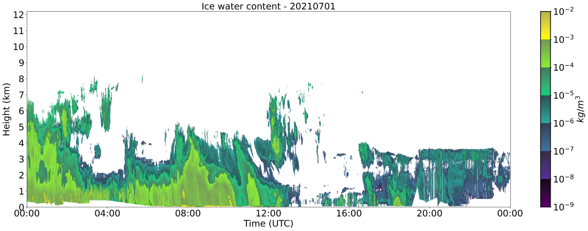
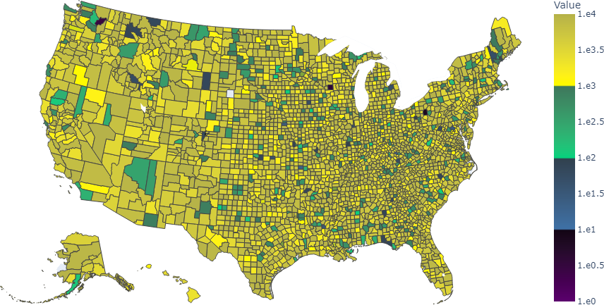

# Order of Magnitude Colors

OMC allows to generate *order of magnitude colors* color schemes from existing 
matplotlib color scales, that can be used in matplotlib visualizations.

OMC color scales are usefull to encode data containing large value ranges.

Details on the method and large value ranges including an application to meteorological data 
can be found in the underlying paper:

*Braun, Daniel, et al. "Color Coding of Large Value Ranges Applied to Meteorological Data." arXiv preprint arXiv:2207.12399 (2022).*

## Installation

```
pip install omccolors
```

## Usage

```
from omccolors import omccolors

##choose matplotlib colormap you want to use:
# Viridis: "viridis"
# Plasma: "plasma"
# ...
cmap = "viridis"

#data_min, data_max: minimum and maximum values of your data

(colormap, min_exp, max_exp) = omccolors.generate_omc(data_min, data_max, cmap)

[ Create a matplotlib figure with 'colormap']
```

## Functions

The following funtions are included in the OMC package:

* Generation of OMC matplotlib scale:
```
generate_omc(min_value, max_value, colorscale)

#input: minimum value, maximum value, matplotlib colorscale (default: "viridis")
#output: (omc colormap, minimum exponent, maximum exponent)
```

* Show the colormap with its greyscale:
```
view_colormap(colorscale)

#input: matplotlib colormap
```

* Show the RGB and HSV gradients of a matplotlib colormap:
```
show_gradients(colorscale)

#input: matplotlib colormap
```

* Get the corresponding RGB color values for a specific data point:
```
get_rgb(colorscale, value, max_exp, min_exp)

#input: matplotlib colormap, value of a data point, maximum exponent, minimum exponent
#output: RGB-values from the respective point in the colormap
```

* Get the corresponding HSV color values for a specific data point:
```
get_hsv(colorscale, value, max_exp, min_exp)

#input: matplotlib colormap, value of a data point, maximum exponent, minimum exponent
#output: HSV-values from the respective point in the colormap
```

* Show the perceived color differences between adjacent colors
```
col_diff_adj(colorscale)

#input: matplotlib colormap
```

* Show the perceived color differences from the colormap to the background
```
col_diff_back(colorscale)

#input: matplotlib colormap
```

* Show the perceived color differences between the colors of each exponent
```
col_diff_exp(min_exp, max_exp, colorscale)

#input: minimum exponent, maximum exponent, matplotlib colormap
```

* Show the perceived color differences between the atrt end end colors of each exponent
```
col_diff_se(min_exp, max_exp, colorscale)

#input: minimum exponent, maximum exponent, matplotlib colormap
```

## Examples

The code for the examples can be found in 'examples/'

### Scatterplot



### Choropleth



## Credits

Based on the work by Braun et al.:

*Braun, Daniel, et al. "Color Coding of Large Value Ranges Applied to Meteorological Data." arXiv preprint arXiv:2207.12399 (2022).*

## License

This code is released under the MIT. See LICENSE for details.
